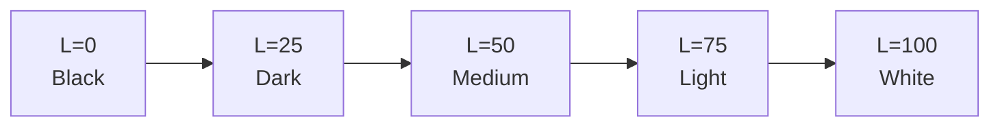
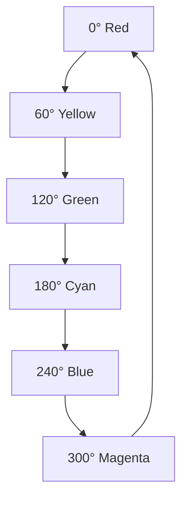
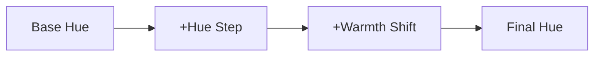

# LCH Color Space Guide

## Understanding Perceptual Color

LCH (Lightness, Chroma, Hue) is a cylindrical representation of the CIE L\*a\*b\* color space, designed to align with human color perception.

## The Three Dimensions

### Lightness (L)

**Range:** 0 to 100

- **0** — Absolute black
- **50** — Medium gray / mid-tone colors
- **100** — Absolute white

**Perceptual Property:** Equal steps in Lightness correspond to equal perceived brightness differences. This is a major advantage over HSL, where lightness perception varies with hue.



### Chroma (C)

**Range:** 0 to ~130 (varies by hue and lightness)

- **0** — No color (neutral gray)
- **Low (1-30)** — Muted, desaturated colors
- **Medium (30-60)** — Balanced saturation
- **High (60+)** — Vivid, saturated colors

**Important:** Maximum achievable chroma depends on the combination of hue and lightness. Some hue/lightness combinations cannot reach high chroma values in sRGB.

### Hue (H)

**Range:** 0° to 360°

Standard color wheel positions:

- **0° / 360°** — Red
- **60°** — Yellow
- **120°** — Green
- **180°** — Cyan
- **240°** — Blue
- **300°** — Magenta

**Perceptual Property:** Equal angular distances represent equal perceptual color differences (unlike HSL where hue spacing is uneven).



## LCH vs HSL

### Why LCH is Superior

**Perceptual Uniformity:**

```javascript
// HSL: These look very different in brightness
hsl(0, 100%, 50%)   // Bright red
hsl(240, 100%, 50%) // Dark blue

// LCH: These have equal perceived brightness
lch(50, 100, 0)     // Red at L=50
lch(50, 100, 240)   // Blue at L=50
```

**Color Interpolation:**

When creating gradients or palettes:

- **HSL interpolation** — Passes through muddy intermediate colors
- **LCH interpolation** — Maintains vibrant intermediate colors

**Predictable Behavior:**

- Equal numeric changes in LCH = equal perceived changes
- HSL has compressed yellows, stretched blues
- LCH provides even distribution

## Practical Usage

### Creating Harmonious Palettes

**Monochromatic:**
```javascript
// Fixed H and C, vary L
lch(20, 50, 180) // Dark
lch(40, 50, 180) // Medium-dark
lch(60, 50, 180) // Medium-light
lch(80, 50, 180) // Light
```

**Analogous:**
```javascript
// Vary H by small steps (±30°)
lch(60, 50, 180) // Base cyan
lch(60, 50, 150) // Blue-cyan
lch(60, 50, 210) // Green-cyan
```

**Complementary:**
```javascript
// Opposite hues (180° apart)
lch(60, 50, 0)   // Red
lch(60, 50, 180) // Cyan
```

### Adjusting Color Properties

**Making colors lighter/darker:**
```javascript
// Just adjust L, keep C and H constant
lch(30, 50, 120) // Dark green
lch(70, 50, 120) // Light green
```

**Increasing/decreasing saturation:**
```javascript
// Just adjust C, keep L and H constant
lch(60, 10, 240) // Muted blue
lch(60, 80, 240) // Vivid blue
```

**Shifting hue:**
```javascript
// Just adjust H, keep L and C constant
lch(60, 50, 0)   // Red
lch(60, 50, 30)  // Orange
lch(60, 50, 60)  // Yellow
```

## Color Gamut Limitations

Not all LCH colors can be displayed in sRGB:

**Out-of-gamut scenarios:**

1. High chroma + extreme lightness
2. High chroma + certain hues (especially yellows)
3. Combinations that exceed sRGB triangle

**Handling out-of-gamut colors:**

The generator clamps RGB values to 0-255 range, which can shift the perceived hue and chroma. This is why very high chroma values might not look as expected.

**Safe ranges for sRGB:**

- **L:** 10-90 (avoid extreme blacks/whites)
- **C:** 0-70 (conservative, works for most hues)
- **H:** Any (0-360°)

## Hue Shifting Technique

This generator uses progressive hue shifting to create dynamic palettes:



**Warmth/Undertone Adjustment:**

- **Positive values** — Shift toward warm (red/yellow)
- **Negative values** — Shift toward cool (blue/green)
- **Creates natural color progressions**

Example progression:
```javascript
// Base at 180° (cyan), hueStep=15°, warmth gradient
180° + 0×15 + 0  = 180° (cyan)
180° + 1×15 + 2  = 197° (blue-cyan, slightly cool)
180° + 2×15 + 4  = 214° (blue-cyan, cooler)
// ...continues with increasing warmth shift
```

## Best Practices

### For UI Design

**Text readability:**
- High contrast: L difference > 50
- Body text: L=20 on L=95, or L=95 on L=20
- Muted UI: Lower C values (10-30)

**Accent colors:**
- Higher C values (50-80) for buttons, links
- Consistent L values across accent colors for visual balance
- Use complementary hues for contrast

### For Brand Palettes

**Primary color:**
- Define in LCH for consistency
- L=50-60 for versatility
- C=40-70 for recognizability

**Tints and shades:**
- Vary only L, keep C and H constant
- Create 5-7 stops from L=10 to L=90

**Secondary colors:**
- Use analogous or triadic hue relationships
- Match L and C values of primary

## Color Accessibility

**WCAG Contrast Requirements:**

LCH makes it easier to meet contrast requirements:

- **AAA (7:1):** L difference ~60-70
- **AA (4.5:1):** L difference ~40-50
- **AA Large (3:1):** L difference ~30

**Note:** These are approximations. Always verify with actual contrast calculators.

## References

- [CIE L\*C\*h° Color Space](https://en.wikipedia.org/wiki/CIELAB_color_space#Cylindrical_representation:_CIELCh_or_CIEHLC) — Wikipedia
- [LCH Colors in CSS](https://lea.verou.me/2020/04/lch-colors-in-css-what-why-and-how/) — Lea Verou
- [Okay, Color Spaces](https://ericportis.com/posts/2024/okay-color-spaces/) — Eric Portis
