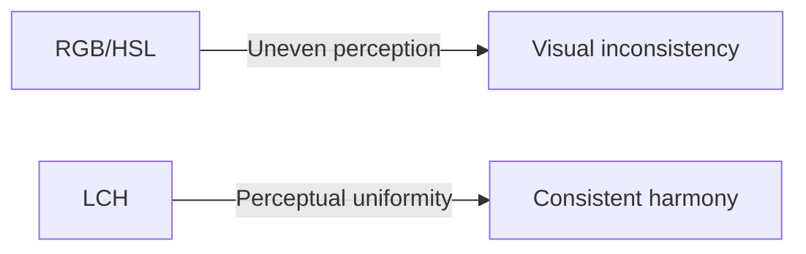
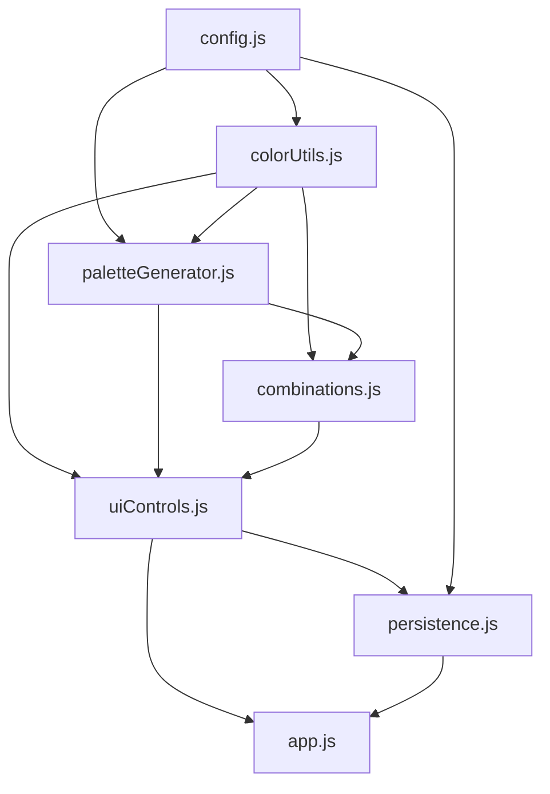

# Read Me

## LCH Color Palette Generator

An interactive tool for generating harmonious color palettes using the perceptually uniform LCH (Lightness, Chroma, Hue) color space with intelligent hue shifting algorithms.

## Introduction

The LCH Color Palette Generator creates sophisticated color palettes by working directly in the LCH color space, which provides better perceptual uniformity than traditional RGB or HSL models. The tool allows fine-grained control over hue progression, lightness range, and chromatic undertones to produce aesthetically pleasing color combinations.

**Key Features:**

• **Perceptual Uniformity** — LCH color space ensures consistent perceived color differences  
• **Hue Shifting** — Controlled hue progression creates natural color transitions  
• **Undertone Control** — Adjust warm/cool color character independently  
• **Multiple Presentations** — View combinations as bars, gradients, or circular dots  
• **Shareable URLs** — Share palettes via encoded URL parameters  
• **Modular Architecture** — Clean separation of concerns across 7 JavaScript modules

**Purpose:** This tool enables designers and developers to create color systems based on perceptual color science principles, producing harmonious palettes suitable for interfaces, brands, and visual systems.

## Quick Start

### Generating a Palette

**Basic Controls:**

1. **Base Color** — Select starting color with color picker
2. **Hue Step** — Control angular distance between hues (1-45°)
3. **Lightness Range** — Set minimum and maximum lightness values (0-100)
4. **Undertones** — Adjust warm/cool character progression (-30 to +30)

**Quick Actions:**

• **Randomize Color** — Generate random base color, keep other settings  
• **Randomize All** — Randomize all parameters for exploration  
• **Swap Lightness** — Invert lightness progression (dark to light ↔ light to dark)  
• **Swap Undertones** — Reverse undertone progression (warm to cool ↔ cool to warm)

### Keyboard Shortcuts

• **Enter** — Toggle fullscreen mode  
• **Theme Toggle** — Switch between light and dark interface

### Presentation Modes

Switch between three visualization modes:

• **Bars** — Classic horizontal color bars with spacing  
• **Gradients** — Smooth color transitions between combinations  
• **Dots** — Circular color presentation for compact viewing

## Understanding LCH Color Space

### What is LCH?

LCH (Lightness, Chroma, Hue) is a perceptually uniform color space derived from the CIE L\*a\*b\* color model:

• **L (Lightness)** — 0 (black) to 100 (white)  
• **C (Chroma)** — 0 (gray) to ~130 (maximum saturation)  
• **H (Hue)** — 0° to 360° (color wheel angle)

### Why LCH?

Traditional RGB and HSL color spaces are not perceptually uniform — equal numeric changes don't produce equal perceived color differences. LCH solves this problem:



**Benefits:**

1. Equal numeric differences = equal perceived differences
2. Predictable color progression for gradients
3. Better interpolation between colors
4. Scientifically-based color relationships

## Sharing & Persistence

### Share Links

Click **Share Link** to copy a URL containing all current settings and combinations. The URL uses base64-encoded JSON in the hash fragment:

```
https://example.com/index.html#{base64-encoded-state}
```

### Save/Load

• **Save** — Download current palette as JSON file  
• **Load** — Import previously saved palette JSON

**State includes:**

- Base color
- Hue step, lightness range, undertones
- Current color combinations
- Active presentation tab

## Color Combinations

The generator automatically creates harmonious combinations:

• **2 Colors** — Complementary and analogous pairings  
• **3 Colors** — Triadic and split-complementary schemes  
• **4 Colors** — Tetradic and extended harmonies

**Shuffle:** Regenerate combinations while keeping the palette colors constant.

## Technical Overview

### Architecture

The application uses a modular JavaScript architecture:



### Modules

1. **config.js** — Configuration constants and global state
2. **colorUtils.js** — Color space conversions (LCH ↔ RGB ↔ HSL ↔ HEX)
3. **paletteGenerator.js** — Palette generation algorithms
4. **combinations.js** — Combination generation and rendering
5. **uiControls.js** — User interface interactions
6. **persistence.js** — Save/load/share functionality
7. **app.js** — Application initialization and event binding

## Credits

**Concept & Implementation:** ddelcourt — 2026

**Based on:** [Coloring with Code: A Programmatic Approach to Design](https://tympanus.net/codrops/2021/12/07/coloring-with-code-a-programmatic-approach-to-design/) by George Francis

**Color Science:** CIE L\*C\*h° color space specification

## Additional Resources

- [Technical Documentation](docs.html?page=technical) — Module reference and API documentation
- [LCH Color Space](docs.html?page=lch-guide) — Deep dive into perceptual color theory
- [GitHub Repository](#) — Source code and development notes
