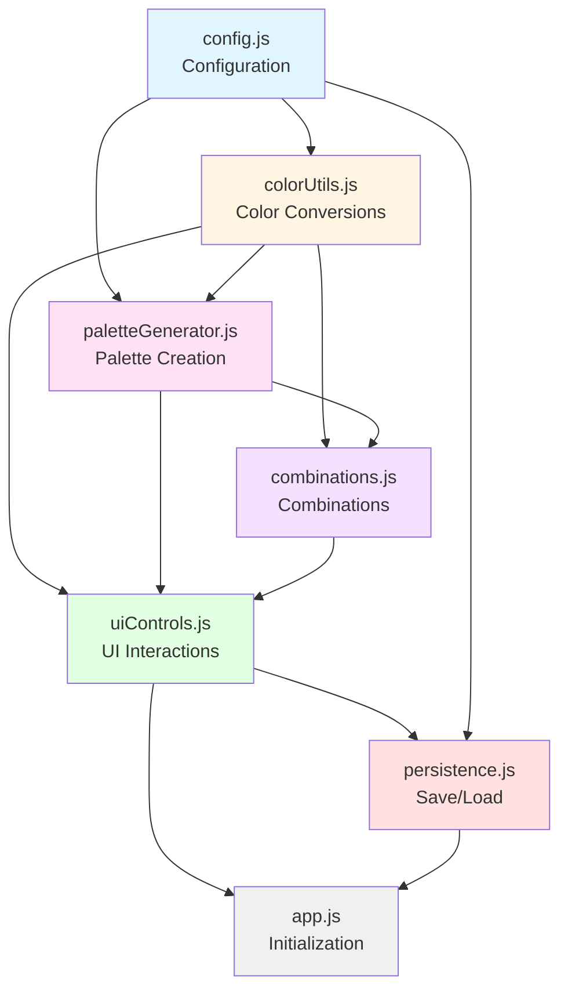
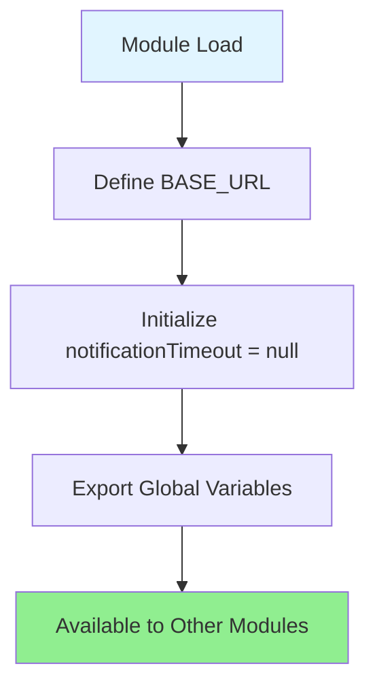
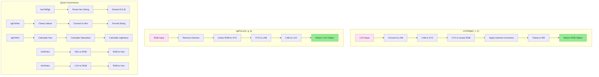
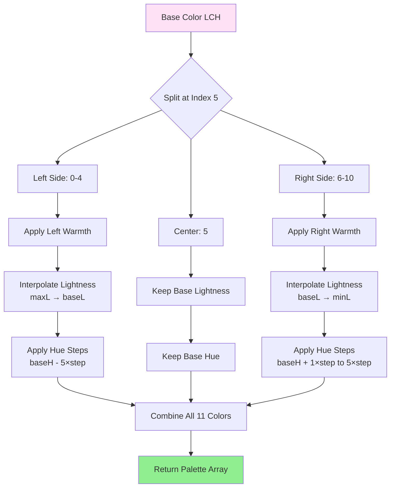
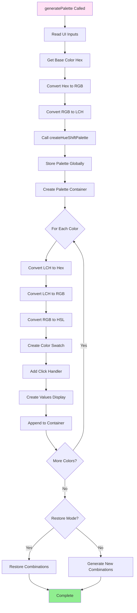
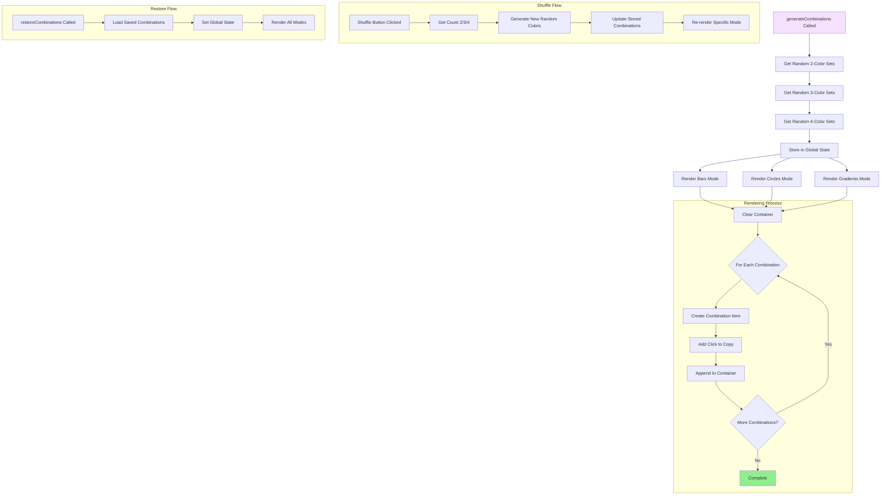
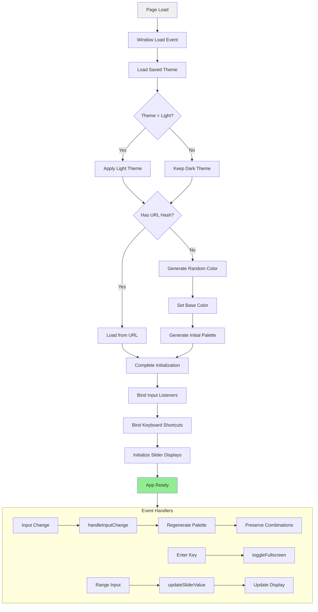
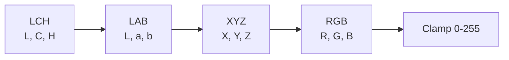

# Technical Documentation

## Module Architecture

The LCH Palette Generator is built using a modular JavaScript architecture with 7 specialized modules, each handling a specific aspect of the application.

### Module Dependency Graph



### Module Loading Order

Modules must be loaded in dependency order:

1. `config.js` — No dependencies
2. `colorUtils.js` — No dependencies
3. `paletteGenerator.js` — Requires: colorUtils
4. `combinations.js` — Requires: colorUtils
5. `uiControls.js` — Requires: paletteGenerator, combinations
6. `persistence.js` — Requires: config, uiControls
7. `app.js` — Requires: all modules

## Module Reference

### config.js (30 lines)

**Purpose:** Global configuration and shared state

**Exports:**
- `BASE_URL` — Base URL for share links
- `notificationTimeout` — Timeout handle for notifications

**Dependencies:** None

**Module Flow:**



---

### colorUtils.js (175 lines)

**Purpose:** Color space conversion utilities

**Functions:**

#### `lchToRgb(l, c, h)`
Converts LCH color to RGB values.

**Parameters:**
- `l` (number) — Lightness (0-100)
- `c` (number) — Chroma (0-130)
- `h` (number) — Hue angle (0-360)

**Returns:** `{r: number, g: number, b: number}` — RGB values (0-255)

#### `rgbToHex(r, g, b)`
Converts RGB values to hexadecimal color string.

**Returns:** `string` — Hex color (e.g., "#FF5733")

#### `hexToRgb(hex)`
Parses hexadecimal color string to RGB object.

**Returns:** `{r: number, g: number, b: number}`

#### `rgbToLch(r, g, b)`
Converts RGB to LCH color space via Lab intermediate.

**Returns:** `{l: number, c: number, h: number}`

#### `rgbToHsl(r, g, b)`
Converts RGB to HSL color space.

**Returns:** `{h: number, s: number, l: number}`

#### `hslToHex(h, s, l)`
Converts HSL directly to hexadecimal color.

**Returns:** `string` — Hex color

#### `lchToHex(l, c, h)`
Convenience function combining LCH → RGB → Hex.

**Returns:** `string` — Hex color

**Dependencies:** None

**Module Flow:**



---

### paletteGenerator.js (125 lines)

**Purpose:** Core palette generation algorithms

**Functions:**

#### `adjustHue(hue, adjustment)`
Wraps hue value to 0-360° range.

**Parameters:**
- `hue` (number) — Base hue angle
- `adjustment` (number) — Degrees to shift

**Returns:** `number` — Normalized hue (0-360)

#### `map(value, inMin, inMax, outMin, outMax)`
Linear interpolation/mapping utility.

**Returns:** `number` — Mapped value

#### `createHueShiftPalette(options)`
Generates palette with progressive hue shifting.

**Parameters:**
- `options.base` — Base LCH color
- `options.minLightness` — Minimum L value
- `options.maxLightness` — Maximum L value
- `options.hueStep` — Angular hue shift per step
- `options.leftWarmth` — Warm/cool shift (left side)
- `options.rightWarmth` — Warm/cool shift (right side)

**Returns:** `Array<{l, c, h}>` — Array of 11 LCH colors

**Algorithm:**



#### `generatePalette(restore = false)`
Main palette generation orchestrator. Reads UI inputs, generates palette, renders swatches, and creates combinations.

**Module Flow:**



**Dependencies:** colorUtils (hexToRgb, rgbToLch, lchToHex, lchToRgb, rgbToHsl)

---

### combinations.js (479 lines)

**Purpose:** Color combination generation and rendering

**Functions:**

#### `getRandomColors(count)`
Selects random colors from current palette.

**Returns:** `Array<string>` — Array of hex colors

#### `generateCombinations()`
Generates 2, 3, and 4-color combinations and renders them in all presentation modes.

#### Render Functions

- `renderBarsMode(container, combinations)` — Horizontal bar layout
- `renderCirclesMode(container, combinations)` — Circular dot layout
- `renderGradientsMode(container, combinations)` — Gradient layout

#### Creation Functions

- `createCombinationItem(colors)` — Creates bar combination
- `createCircleCombinationItem(colors)` — Creates circle combination
- `createGradientCombinationItem(colors)` — Creates gradient combination

#### Shuffle Functions

- `shuffleTwoCombinations()` — Regenerate 2-color combinations
- `shuffleThreeCombinations()` — Regenerate 3-color combinations
- `shuffleFourCombinations()` — Regenerate 4-color combinations

#### `restoreCombinations(savedCombinations)`
Restores previously saved combinations (used when changing base color while keeping combinations).

**Module Flow:**



**Dependencies:** colorUtils (lchToRgb, rgbToHsl)

---

### uiControls.js (230 lines)

**Purpose:** User interface interaction handlers

**Functions:**

#### `swapWarmth()`
Swaps left and right warmth values, regenerates palette.

#### `swapLightness()`
Swaps minimum and maximum lightness values, regenerates palette.

#### `randomizeColor()`
Generates random HSL color, applies as base color.

#### `randomizeAll()`
Randomizes all parameters: base color, lightness range, hue step, warmth.

#### `toggleTheme()`
Switches between light and dark themes, persists to localStorage.

#### `switchTab(mode)`
Switches presentation mode: 'bars', 'circles', or 'gradients'.

#### `updateSliderValue(slider)`
Updates slider's visual value display.

#### `handleInputChange()`
Generic input change handler, regenerates palette while preserving combinations.

#### `toggleFullscreen()`
Enters/exits fullscreen mode.

**Module Flow:**



```mermaid
flowchart TD
    subgraph SWAP_WARMTH["swapWarmth()"]
        A1[Get Left/Right Inputs] --> A2[Swap Values]
        A2 --> A3[Update Slider Displays]
        A3 --> A4[Store Current Combinations]
        A4 --> A5[Generate Palette]
        A5 --> A6[Restore Combinations]
    end
    
    subgraph SWAP_LIGHTNESS["swapLightness()"]
        B1[Get Min/Max Inputs] --> B2[Swap Values]
        B2 --> B3[Update Slider Displays]
        B3 --> B4[Store Current Combinations]
        B4 --> B5[Read All Parameters]
        B5 --> B6[Convert Base to LCH]
        B6 --> B7[Create Hue Shift Palette]
        B7 --> B8[Store & Render Palette]
        B8 --> B9[Restore Combinations]
    end
    
    subgraph RANDOMIZE["Randomization"]
        C1[randomizeColor] --> C2[Generate Random HSL]
        C2 --> C3[Convert to Hex]
        C3 --> C4[Set Base Color]
        C4 --> C5[Generate Palette]
        C5 --> C6[Restore Combinations]
        
        D1[randomizeAll] --> D2[Random Base Color]
        D2 --> D3[Random Lightness Range]
        D3 --> D4[Random Hue Step]
        D4 --> D5[Random Warmth Values]
        D5 --> D6[Update All Sliders]
        D6 --> D7[Generate Palette]
    end
    
    subgraph THEME["toggleTheme()"]
        E1[Check Current Theme] --> E2{Is Light?}
        E2 -->|Yes| E3[Switch to Dark]
        E2 -->|No| E4[Switch to Light]
        E3 --> E5[Update Button Text]
        E4 --> E5
        E5 --> E6[Save to localStorage]
    end
    
    subgraph TAB["switchTab(mode)"]
        F1[Deactivate All Tabs] --> F2[Activate Selected Tab]
        F2 --> F3[Hide All Modes]
        F3 --> F4[Show Selected Mode]
    end
    
    subgraph FULLSCREEN["toggleFullscreen()"]
        G1{Is Fullscreen?} -->|No| G2[Enter Fullscreen]
        G1 -->|Yes| G3[Exit Fullscreen]
    end
    
    style A1 fill:#e1ffe1
    style B1 fill:#e1ffe1
    style C1 fill:#e1ffe1
    style D1 fill:#e1ffe1
```

**Dependencies:** paletteGenerator, combinations

---

### persistence.js (152 lines)

**Purpose:** Save, load, and share functionality

**Functions:**

#### `copyToClipboard(text)`
Copies text to clipboard, shows notification.

#### `getCurrentState()`
Captures complete application state.

**Returns:** Object containing:
```javascript
{
  version: "1.0",
  baseColor: string,
  hueStep: number,
  minLightness: number,
  maxLightness: number,
  leftWarmth: number,
  rightWarmth: number,
  combinations: object,
  activeTab: string
}
```

#### `loadState(state)`
Restores application from state object.

#### `copyShareLink()`
Generates shareable URL with base64-encoded state in hash fragment.

**URL Format:**
```
https://example.com/index.html#{base64(JSON.stringify(state))}
```

#### `downloadJSON()`
Downloads current state as JSON file.

#### `loadJSON()`
Opens file picker, loads state from JSON file.

#### `loadFromURL()`
Parses and loads state from URL hash on page load.

**Module Flow:**



```mermaid
flowchart TD
    subgraph SHARE["copyShareLink()"]
        A1[Get Current State] --> A2[Stringify to JSON]
        A2 --> A3[Base64 Encode]
        A3 --> A4[Append to BASE_URL]
        A4 --> A5[Create Share URL]
        A5 --> A6[Copy to Clipboard]
        A6 --> A7[Show Notification]
    end
    
    subgraph SAVE["downloadJSON()"]
        B1[Get Current State] --> B2[Stringify with Formatting]
        B2 --> B3[Create Blob]
        B3 --> B4[Create Download Link]
        B4 --> B5[Trigger Download]
        B5 --> B6[Cleanup]
    end
    
    subgraph LOAD["loadJSON()"]
        C1[Create File Input] --> C2[User Selects File]
        C2 --> C3[Read File Contents]
        C3 --> C4{Valid JSON?}
        C4 -->|Yes| C5[Parse State]
        C4 -->|No| C6[Show Error]
        C5 --> C7[Load State]
        C7 --> C8[Show Success]
    end
    
    subgraph URL_LOAD["loadFromURL()"]
        D1{Has Hash?} -->|Yes| D2[Extract Hash]
        D1 -->|No| D3[Skip]
        D2 --> D4[Base64 Decode]
        D4 --> D5{Valid JSON?}
        D5 -->|Yes| D6[Parse State]
        D5 -->|No| D7[Log Error]
        D6 --> D8[Load State]
    end
    
    subgraph STATE["getCurrentState()"]
        E1[Read All Inputs] --> E2[Collect Base Color]
        E2 --> E3[Collect Sliders]
        E3 --> E4[Get Combinations]
        E4 --> E5[Get Active Tab]
        E5 --> E6[Return State Object]
    end
    
    subgraph RESTORE["loadState(state)"]
        F1[Receive State] --> F2[Set Input Values]
        F2 --> F3[Update Slider Displays]
        F3 --> F4[Generate Palette]
        F4 --> F5{Has Combinations?}
        F5 -->|Yes| F6[Restore Combinations]
        F5 -->|No| F7[Skip]
        F6 --> F8[Switch to Saved Tab]
        F7 --> F8
    end
    
    style A1 fill:#ffe1e1
    style B1 fill:#ffe1e1
    style C1 fill:#ffe1e1
    style E6 fill:#90EE90
```

**Dependencies:** config (BASE_URL), uiControls

---

### app.js (48 lines)

**Purpose:** Application initialization and event binding

**Initialization:**

1. Loads saved theme from localStorage
2. Checks for shared URL (loads state if present)
3. Generates random initial color (if not loading from URL)
4. Generates initial palette
5. Binds input event listeners
6. Binds keyboard shortcuts

**Event Listeners:**

- `window.load` — Initialize app
- `keydown (Enter)` — Toggle fullscreen
- `input` — Update palette on input change

**Module Flow:**



**Dependencies:** All modules

## Color Space Conversions

### LCH to RGB Pipeline



### Conversion Formulas

#### LCH → LAB
```javascript
a = C × cos(H × π/180)
b = C × sin(H × π/180)
```

#### LAB → XYZ (D65 illuminant)
```javascript
fy = (L + 16) / 116
fx = a / 500 + fy
fz = fy - b / 200
```

#### XYZ → RGB (sRGB matrix)
```javascript
R = 3.2406 × X - 1.5372 × Y - 0.4986 × Z
G = -0.9689 × X + 1.8758 × Y + 0.0415 × Z
B = 0.0557 × X - 0.2040 × Y + 1.0570 × Z
```

## Performance Considerations

**Palette Generation:**
- Generates 11 colors in ~1-2ms
- No optimization needed for interactive use

**Combination Generation:**
- 2-color: 12 combinations
- 3-color: 12 combinations
- 4-color: 12 combinations
- Total: ~36 DOM elements per mode (108 total)
- Generation time: ~5-10ms

**Rendering:**
- All modes render simultaneously
- CSS controls visibility
- No re-rendering on tab switch

**Memory:**
- Current palette: ~11 color objects
- Combinations: ~36 color arrays
- Total memory footprint: <1KB

## Browser Compatibility

**Required Features:**
- ES6 syntax (arrow functions, const/let, template literals)
- CSS custom properties
- Flexbox and Grid
- Clipboard API
- localStorage
- URL.hash

**Supported Browsers:**
- Chrome 90+
- Firefox 88+
- Safari 14+
- Edge 90+

## Future Enhancements

**Planned Features:**
- Export combinations as CSS variables
- WCAG contrast ratio calculations
- Palette history/undo
- Named palette presets
- Export as ASE/ACO files for Adobe apps
- Color blindness simulation
